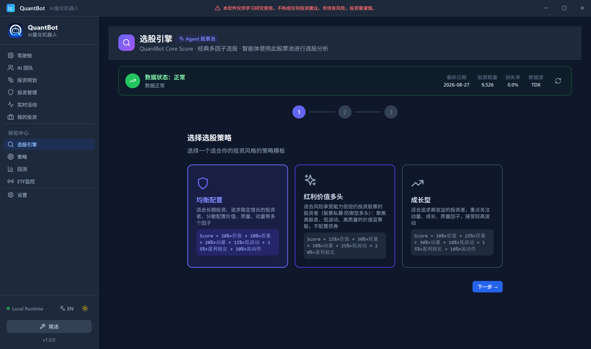
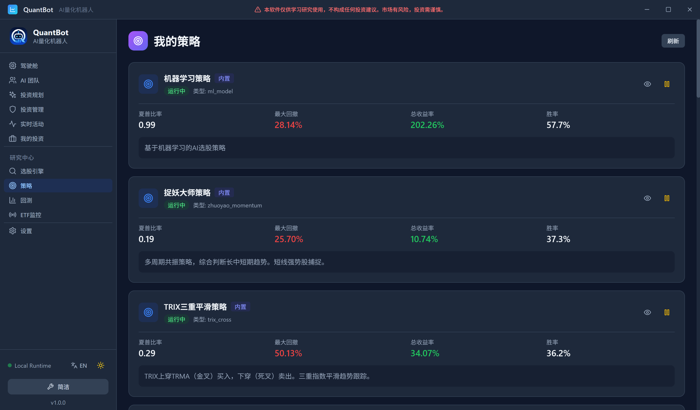
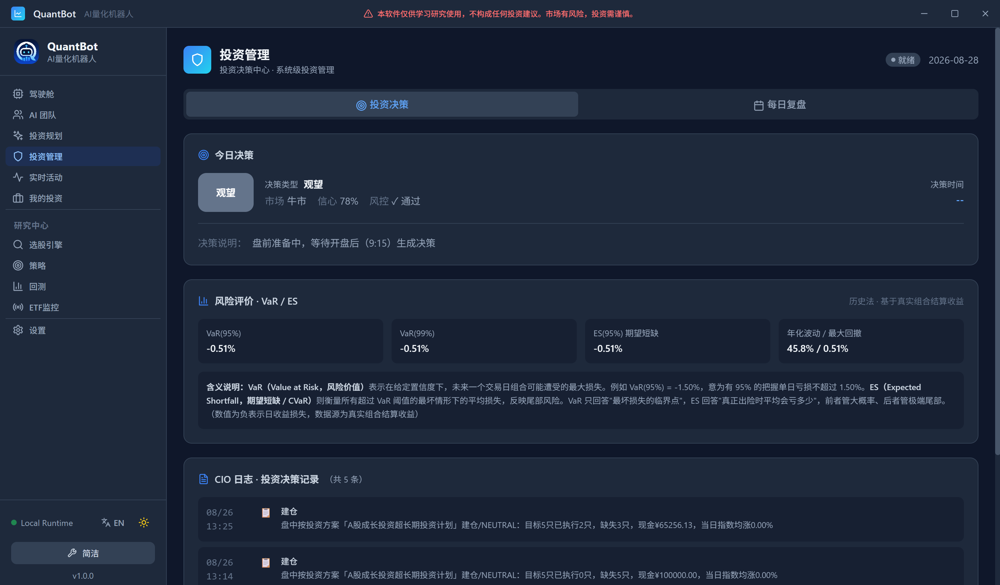

# 🤖 QuantBot

<p align="center">

### 一个真正会每天工作的 A 股量化交易系统

**AI × Quant × Risk × Portfolio × Trading**

<br>

不是聊天机器人，不是简单选股器。  
而是一套从 **研究 → 策略 → 回测 → 风控 → 组合 → 交易 → 复盘** 的完整量化投资工作流。

<br>

[🚀 快速开始](#-快速开始) · [🧠 AI 团队](#-ai-投资团队) ·  [📊 量化能力](#-量化能力) · [🎁 ETF Monitor](#-etf-monitor) · [🗺️ Roadmap](#️-roadmap)

</p>
---
⭐ 如果你觉得 AI + 量化投资很酷，请给这个项目一个 Star


  下载地址：[QuantBot v1.2.0 Release](https://github.com/jeokeo011222/quantbot/releases/download/v1.2.0/QuantBot-v1.2.0.zip)

<br>
⭐ 如果你觉得 AI + 量化投资很酷，请给这个项目一个 Star

---


## 🌟 QuantBot 是什么？

如果每天的投资工作是：

> 看市场 → 找机会 → 做研究 → 选股票 → 回测 → 控风险 → 管组合 → 执行交易 → 复盘

那么 QuantBot 希望把这整个过程放进一个系统。

```text
                QuantBot
                   │
       ┌───────────┼───────────┐
       ↓           ↓           ↓
   Research     Strategy      Risk
       │           │           │
       └───────────┼───────────┘
                   ↓
               Portfolio
                   ↓
                Trading
                   ↓
                Review
                   │
                   └──────→ Next Day
```

它不是让一个大模型扮演“股神”。

而是让：**AI + Quant + Risk + Portfolio + Trading**

共同组成一个每天持续工作的投资系统。

---

# 🧠 AI 投资团队

QuantBot 当前采用多个 AI Agent 协作完成投资工作。

| Agent | 角色 | 主要职责 |
|:---:|---|---|
| 🧭 **Planner** | 投资规划师 | 投资目标、资金规模、风险偏好、投资约束 |
| 🔬 **Quant** | 量化分析师 | 股票池、因子分析、策略、回测、量化评分 |
| 🛡️ **Risk** | 风控师 | 风险识别、仓位约束、市场状态、组合风险 |
| 👔 **CIO** | 首席投资官 | 综合分析并形成最终投资决策 |
| 🤖 **Trader** | AI 操盘手 | 建仓、调仓、仓位调整、模拟 / QMT 实盘 |

### 5 个 Agent，不是 5 个聊天窗口。

每个 Agent 都拥有自己的职责、任务和决策边界。

```text
Planner -> Quant -> Risk -> CIO -> Trader
```

形成完整的投资决策链。

---

<p align="center">
  
</p>


# ⏱️ 每天自动工作的投资流程

QuantBot 不是：

```text
打开 → 问 AI 一个问题 → 关闭
```

而是一套持续运行的工作流。

## 🌅 盘前

```text
昨日复盘 -> Planner -> Quant  -> Risk  -> CIO -> 今日投资决策
```

系统在 A 股开盘前完成当天的投资分析与决策链。

---

## 📈 盘中

```text
市场变化 -> 组合监控 -> 风险状态 -> AI 分析 -> 建仓 / 加仓 / 防守
```

持续监控 ACTIVE / RUNNING 投资方案。

---

## 🌙 盘后

```text
交易结算 -> 因子复盘 -> 策略分析 -> CIO 深度复盘 -> 制定明日计划
```

最终形成：

> **分析 → 决策 → 执行 → 结果 → 复盘 → 再决策**

的完整闭环。

<p align="center">
  
</p>

---

# 📊 不只是 AI

QuantBot 的一个核心原则：

> **LLM 负责理解与决策协作，量化引擎负责计算事实。**

因此 QuantBot 不是：

```text
用户 -> ChatGPT -> “我觉得这只股票不错”
```

而是：

```text
投资方案 -> 量化筛选 -> 因子分析 -> 策略分析 -> 风险分析 -> 组合分析 -> AI Agent 协作 -> 投资决策
```

AI 建立在量化数据和系统状态之上，而不是凭感觉猜股票。

---

# 📈 量化能力

QuantBot 将量化研究、策略和投资管理整合在一起。

| 能力 | 说明 | 截图 |
|------|------|------|
| 🔎 **选股** | 多因子智能选股 |  |
| 🧪 **策略** | 内置多种量化策略及策略指标 |  |
| 📊 **回测** | 收益、最大回撤、Sharpe、胜率、策略表现 |  |
| 💼 **投资组合** | 管理持仓、盈亏、资产曲线、投资方案、每日决策 |  |
| 🧠 **AI 决策** | 让多个 Agent 协作完成每日投资流程 |  |

---

# 🇨🇳 A 股原生

QuantBot 当前专注于：

> **中国 A 股市场**

从数据、策略到交易工作流，都围绕 A 股进行设计。

当前覆盖：

- A 股市场
- 集合竞价相关流程
- 股票池筛选
- 多因子选股
- 市场状态
- 策略回测
- 投资组合
- 风险管理
- AI 投资决策
- 模拟交易
- QMT / XtQuant 实盘接口

> **QuantBot 不是一个泛化交易机器人再加一个 A 股数据源。**
>
> **A 股就是 QuantBot 当前的主要设计环境。**

---

# 🎁 ETF Monitor

如果你不想研究单只股票，QuantBot 里还藏了一个小功能：

## ETF Monitor

它将多个市场信息进行综合：

```text
价格位置 + 份额流向 + 交易方向 + 成交额热度 + 融资杠杆 -> 共振判断
```

最终简化成：

🟢 **机会**    🟡 **观察**   🔴 **风险**

并提供 ETF 共振热力图。

> 不懂选股？    **先看看 ETF。**

---

# 🖥️ 为什么是本地软件？

QuantBot 当前采用：

**Go + React + SQLite + DuckDB + LLM**

### 本地运行

- 📦 下载、解压、运行。下载地址：[QuantBot v1.2.0 Release](https://github.com/jeokeo011222/quantbot/releases/download/v1.2.0/QuantBot-v1.2.0.zip)
- 💾 核心数据与数据库保存在本地
- 🔑 AI 服务使用你自己的 API Key
- ⚡ 本地 DuckDB 用于历史研究数据

### AI 服务

支持：DeepSeek/豆包/千问/OpenAI API 兼容服务


---

# 📡 数据源

当前支持的数据来源包括：

### 实时行情

- TDX
- TDX MCP
- MCP
- 通达信终端接口
- 腾讯财经

### 历史研究数据

- 本地 DuckDB

行情读取与量化研究相互解耦。

---


# 🗺️ Roadmap

QuantBot 目前已经可以完成核心投资工作流。接下来不会无限堆功能，而是：

> **把已有能力做深。**

### 下一阶段

- 更完善的组合风险管理
- 更多因子
- 更多策略
- ETF Monitor 增强
- 数据源扩展
- 社区策略生态

---

# 🌱 Open Source

QuantBot 是一个长期项目。它不是一个几十个人同时开发的大型商业产品。

很多东西来自：

> 一个人不断研究、设计、写代码、测试，然后一点点把它做出来。

最初的问题很简单：

> **“能不能让 AI 帮我做量化投资？”**

然后逐渐变成：

```text
AI Agent -> Quant -> Risk -> Portfolio -> Trading -> Daily Workflow -> Self Review
```

现在，我把它放到 GitHub。希望它能够帮助更多对：**AI × Quant × Finance**感兴趣的人。

---

# 🤝 Community

欢迎对以下方向感兴趣的人参与交流：

- Quantitative Finance
- AI Agent
- LLM
- Algorithmic Trading
- Portfolio Management
- Risk Management
- Factor Investing
- ETF
- Open Source

如果你发现 Bug、产生新的想法，或者希望贡献代码：**欢迎提交 Issue / Pull Request。**

---

# ⚠️ Disclaimer

QuantBot 仅供学习、研究和量化投资实验使用。

程序产生的信号、评分、策略、AI 分析、投资决策及回测结果，均基于历史数据与模型计算。

**不保证未来收益，也不构成任何投资建议。**

金融市场存在风险。

模拟交易结果不代表真实交易结果。使用 QMT 等接口进行实盘交易时，请充分理解相关风险，并遵守适用的法律法规、交易所及券商规定。

请始终只使用你能够承受损失的资金进行投资。

> 💡 程序运行过程中，需要消耗一定的 Token 成本，请根据自己的需要调整刷新频率。

---

# 🤖 QuantBot

<p align="center">

### AI × Quant × Risk × Portfolio × Trading

**让 AI 成为你的投资团队。**

<br>

⭐ Star · 🍴 Fork · 🐛 Issue

<br><br>

**Made with ❤️ by QuantBot Lab**

</p>
