<h1 align="center">🤖 QuantBot</h1>

<p align="center">
  <b>一个真正会每天工作的 AI 投资团队</b><br>
  <sub><i>AI × Quant × Risk × Portfolio × Trading</i></sub>
</p>

<p align="center">
  
  
  
  
</p>

<p align="center">
  <b>不是聊天机器人。不是简单选股器。</b><br>
  而是一支由 <b>5 个 AI Agent</b> 协作完成投资工作的量化团队。
</p>

<p align="center">
  <a href="#quickstart">🚀 快速开始</a> ·
  <a href="#agents">🤖 五个 Agent</a> ·
  <a href="#quant">📊 量化能力</a> ·
  <a href="#etf">🎁 ETF 彩蛋</a> ·
  <a href="#community">🤝 加入社区</a>
</p>

---

<p align="center">下载地址：[QuantBot v1.1.0 Release](https://github.com/jeokeo011222/quantbot/releases/download/v1.1.0-build.2/QuantBot-v1.1.0-full.zip)</p>

---

<h2 align="center">⭐ 如果你觉得 AI + 量化投资很酷，请给这个项目一个 Star</h2>

<p align="center">
  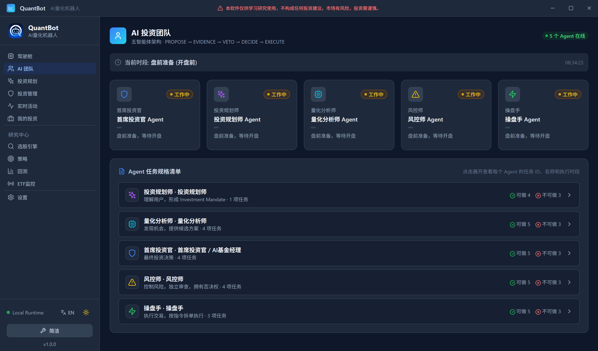
</p>

---

## 🧠 如果你的投资账户拥有一个 AI 团队，那会怎么样？

想象一下：

- 🌅 **每天开盘前** —— 有人帮你分析市场
- 📈 **盘中** —— 有人盯着你的组合
- ⚠️ **风险发生变化** —— 有人提醒你
- ⚖️ **需要调整仓位** —— 有人进行分析
- 🌙 **收盘以后** —— 有人复盘今天的每一个决定，第二天继续工作

**这就是 QuantBot 想做的事情。**

它**不是**让一个大模型扮演"股神"，而是让 **多个 AI Agent 分工合作**：

<p align="center">
  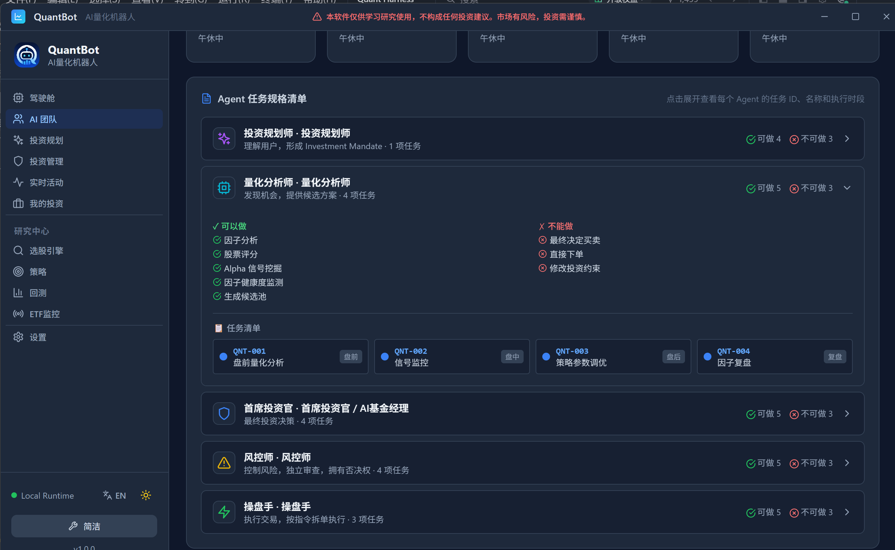
</p>

> **5 个 Agent，不是 5 个聊天窗口。**
> 它们拥有不同的职责、任务和决策边界。

---

## 💎 核心亮点

<p align="center">
  <b>AI × Quant × Risk × Portfolio × Trading</b>
</p>

QuantBot 将 **LLM × 量化分析 × 因子研究 × 风险管理 × 组合管理 × 策略回测 × 自动工作流** 组合到了一起。

> ### 🎯 目标只有一个：
> ### 让投资从"每天自己研究"，变成"每天有一支 AI 团队帮你工作"。

<p align="center">
  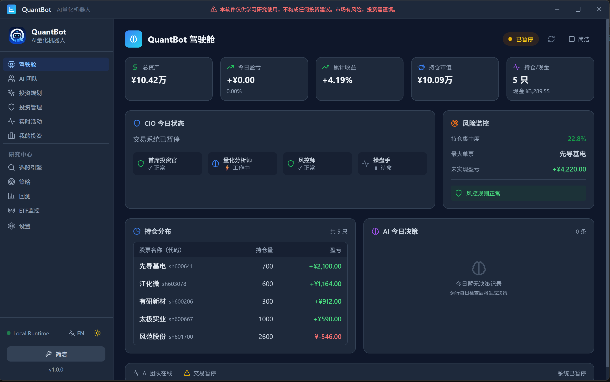
</p>

---

## 🕐 AI 团队每天都在工作

QuantBot **不是**：打开 → 问 AI 一个问题 → 关闭。

而是一套**持续运行的投资工作流**：

<p align="center">
  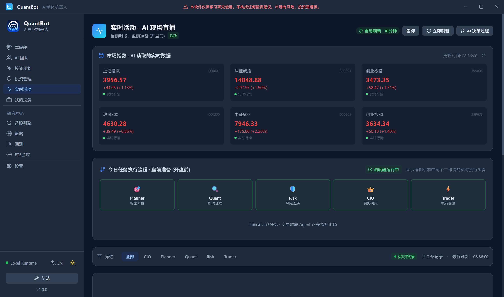
</p>

### 🌅 盘前

```text
昨日复盘 → Planner → Quant → Risk → CIO → 今日投资决策
```

系统会在 A 股开盘前完成当天的 AI 决策链。

### 📈 盘中

```text
市场变化 → 组合监控 → 风险状态 → AI 分析 → 建仓 / 加仓 / 防守
```

系统持续监控 ACTIVE / RUNNING 投资方案。

### 🌙 盘后

```text
交易结算 → 因子复盘 → 策略分析 → CIO 深度复盘 → 制定明日计划
```

于是形成 —— **分析 → 决策 → 执行 → 结果 → 复盘 → 再决策** 的完整闭环。

---

<a id="agents"></a>

## 🤖 五个 AI Agent

| # | Agent | 角色 | 职责 |
|---|-------|------|------|
| 01 | **Planner** | 🧭 投资规划师 | 理解资金规模、投资目标、风险偏好、约束 |
| 02 | **Quant** | 🔬 量化分析师 | 股票池、因子分析、策略、回测、量化评分 |
| 03 | **Risk** | 🛡️ 风控师 | 风险识别、仓位约束、市场状态、组合风险 |
| 04 | **CIO** | 👔 首席投资官 | 综合各方分析，做出**最终投资决策** |
| 05 | **Trader** | 🤖 AI 操盘手 | 建仓、调仓、仓位调整、模拟/QMT 实盘 |

### 01 · Planner 投资规划师

负责理解：资金规模、投资目标、风险偏好、投资约束，然后把人的投资需求转化成投资方案。

<p align="center">
  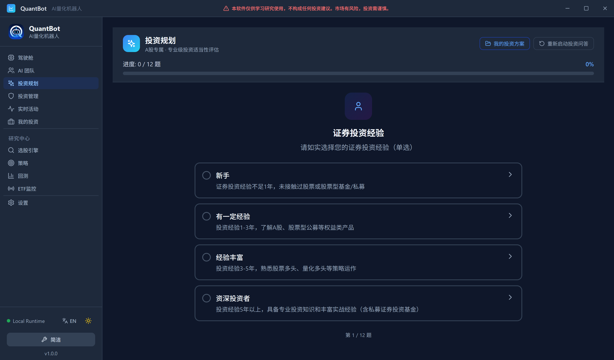
</p>

### 02 · Quant 量化分析师

**让数据负责计算，而不是让 AI 凭感觉猜股票。**

负责：股票池、因子分析、策略分析、数据分析、回测、量化评分。

### 03 · Risk 风控师

始终问一个问题：

> **"这个决定，会让组合承担多大的风险？"**

负责：风险识别、风险检查、仓位约束、市场状态、组合风险。

### 04 · CIO 首席投资官

综合 Planner、Quant、Risk 的分析，负责**最终投资决策**。

不是简单地把三个 Agent 的答案拼起来，而是形成完整的决策链。

### 05 · Trader AI 操盘手

负责执行：建仓、调仓、仓位调整、交易约束、模拟交易、QMT 实盘接口。

<p align="center">
  
</p>

---

<a id="quant"></a>

## 📊 不只是 AI

QuantBot 的一个核心原则：

> **LLM 负责理解与决策协作。量化引擎负责计算事实。**

所以它不是 —— `用户 → ChatGPT → "我觉得这只股票不错"`

而是：

```text
投资方案 → 量化筛选 → 因子分析 → 风险分析 → 组合分析
    ↓
AI Agent 协作 → 投资决策
```

<p align="center">
  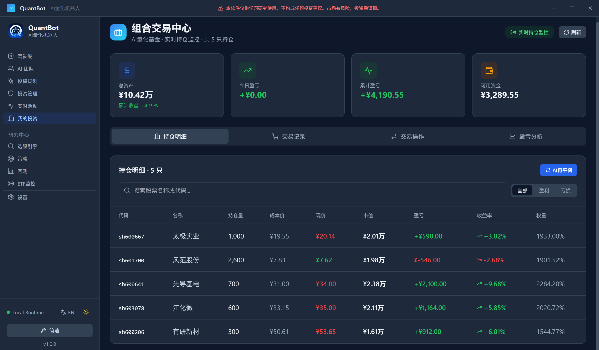
</p>

## 📈 内置量化能力

| 能力 | 说明 | 截图 |
|------|------|------|
| 🔎 **选股** | 多因子智能选股 |  |
| 🧪 **策略** | 内置多种量化策略及策略指标 |  |
| 📊 **回测** | 收益、最大回撤、Sharpe、胜率、策略表现 | 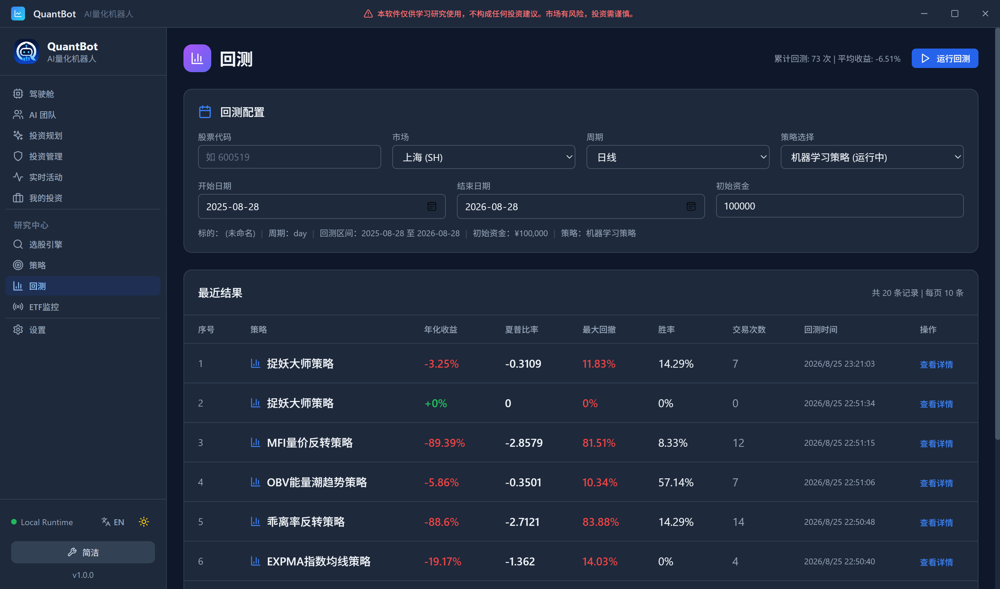 |
| 💼 **投资组合** | 管理持仓、盈亏、资产曲线、投资方案、每日决策 | 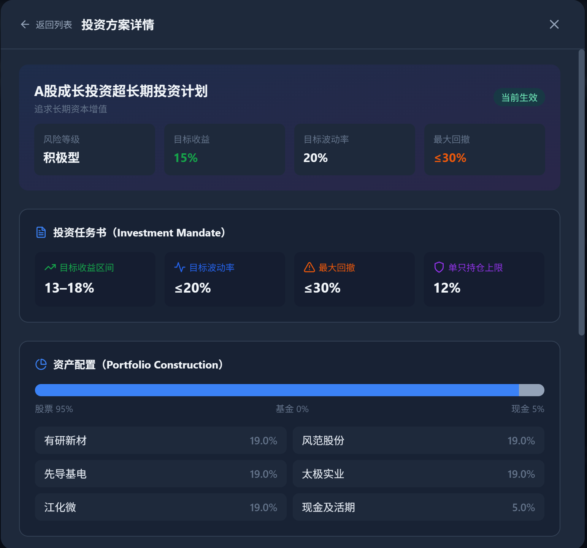 |
| 🛡️ **风险** | 从组合角度监控风险 | — |
| 🧠 **AI 决策** | 让多个 Agent 协作完成每日投资流程 |  |
| 📋 **审计** | 记录 AI 调用、投资规划、选股、策略、回测、CIO 决策、系统事件 | — |

---

<a id="etf"></a>

## 🎁 Hidden Feature · ETF Monitor

<p align="center">
  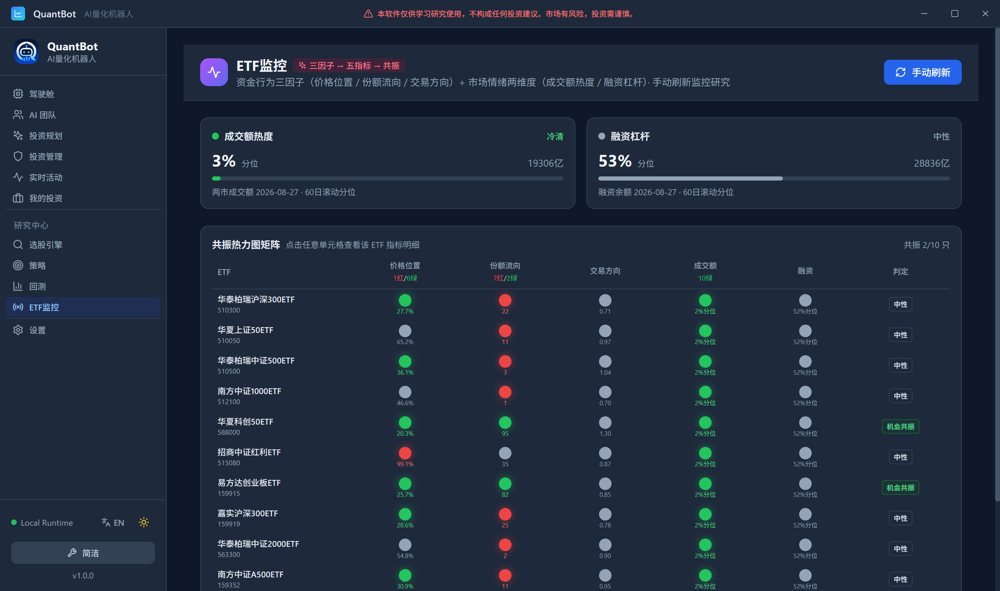
</p>

给不想研究个股的人 —— 如果你看到这里，觉得"股票实在太复杂了"，没关系，这里还偷偷放了一个小彩蛋。

**📡 ETF Monitor** —— 专门给普通投资爱好者设计，不需要懂复杂的量化模型。

```text
价格位置 + 份额流向 + 交易方向 + 成交额热度 + 融资杠杆 → 共振判断
```

最后直接变成：🟢 机会 / 🟡 观察 / 🔴 风险。

甚至直接做成了 **🔥 ETF 共振热力图** —— 一眼看完整个 ETF 池，只需要看：**现在是红？黄？还是绿？**

### 💡 为什么做这个功能？

因为并不是所有人都适合直接投资单只股票。对于非专业投资者、刚开始接触投资的人、不想承担个股风险的人、更喜欢分散化投资的人，ETF 可能是一个更值得研究的方向。

> **不懂选股？先看看 ETF。**

---

## ⚡ 为什么是本地软件？

QuantBot 当前采用 **Go + React + SQLite + DuckDB + LLM**，绿色免安装 —— 下载、解压、运行。

- 📦 核心数据与数据库保存在**本地**
- 🔑 AI 服务使用你自己的 API Key
- 🌐 支持：**DeepSeek · 豆包 · 千问 · OpenAI API 兼容服务**

---

<a id="quickstart"></a>

## 🚀 Quick Start

| 步骤 | 操作 |
|------|------|
| 1️⃣ **下载** | 前往 GitHub Releases 下载最新版本 `QuantBot.zip` |
| 2️⃣ **解压** | 直接解压到任意普通目录，如 `D:\QuantBot\` |
| 3️⃣ **启动** | 双击 `QuantBot.exe`，无需复杂安装 |
| 4️⃣ **配置 AI** | 进入 `设置 → AI`，选择 AI 服务商并填写 API Key |
| 5️⃣ **开始使用** | 设置初始资金 → 配置 AI → 完成投资规划 → 启动 AI 团队 |

然后让它开始工作。

---

## 🧪 第一次使用？请先模拟

强烈建议：

```
模拟模式 → 观察 AI → 验证策略 → 验证交易 → 验证风险 → 充分测试 → 再考虑实盘
```

QuantBot 支持模拟交易，也支持 QMT / XtQuant 实盘接口。

> ⚠️ **不要因为看到一个漂亮的回测结果，就马上把真金白银交给程序。**
>
> **市场永远比回测复杂。**

---

## 🛠️ 数据源

<p align="center">
  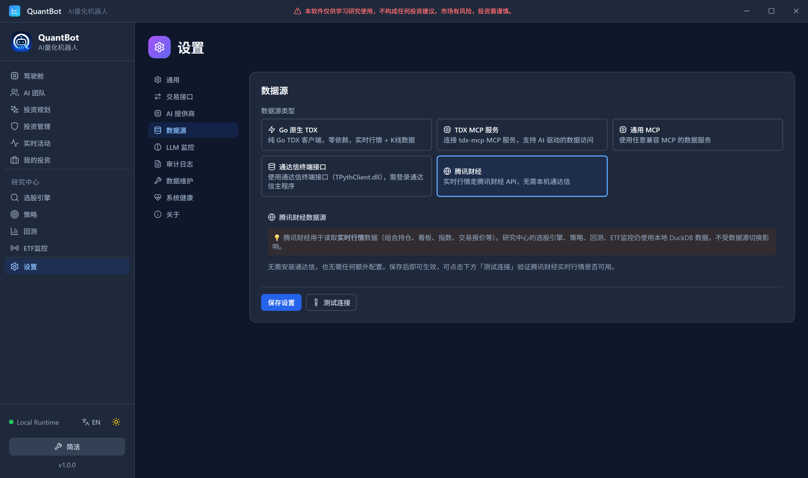
</p>

- ⚡ **实时行情**：原生 TDX、TDX MCP、MCP、通达信终端接口、腾讯财经
- 📚 **历史研究数据**：本地 DuckDB

> **行情读取与量化研究相互解耦。**

---

## 🧩 项目架构

```text
┌─────────────────────────────────────────────┐
│                  QuantBot                   │
├─────────────────────────────────────────────┤
│              React Frontend                 │
│                     │                       │
│                     ▼                       │
│               Go Application                │
│        ┌────────────┼────────────┐          │
│        ▼            ▼            ▼          │
│    AI Agents   Quant Engine   Risk Engine   │
│        │            │            │          │
│        ▼            ▼            ▼          │
│       LLM        DuckDB       Portfolio     │
│                     │                       │
│                     ▼                       │
│                  SQLite                    │
└─────────────────────────────────────────────┘
```

---

## 🧭 Roadmap

QuantBot 现在已经可以完成核心投资工作流。接下来，我更希望把**已有能力做深，而不是无限堆功能。**

重点方向：

- ✅ 更稳定的 AI Agent 协作
- ✅ 更完善的建仓系统
- ✅ 动态仓位管理
- ✅ 每日投资工作流优化
- 🔜 更完善的组合风险管理
- 🔜 更多因子、更多策略、ETF 监控增强
- 🔜 数据源扩展、社区策略生态

---

## 🌱 Open Source

QuantBot 是一个长期项目。它不是一个商业公司投入几十个人做出来的产品，很多内容来自——

> **一个人不断研究、设计、写代码、测试，然后一点点把它做出来。**

从最初的"能不能让 AI 帮我做量化投资？"，慢慢变成一套完整的 `AI Agent → Quant → Risk → Portfolio → Trading → Daily Workflow → Self Review`。

现在，我把它放到 GitHub，希望能帮助更多对 **AI + Quant + Finance** 感兴趣的人。

---

<a id="community"></a>

## 🤝 Community

欢迎所有对以下方向感兴趣的人一起交流：

**Quantitative Finance · AI Agent · LLM · Algorithmic Trading · Portfolio Management · Risk Management · Factor Investing · ETF · Open Source**

### 💎 付费群（￥500 元）

经用户建议，决定开展付费（入群费用：￥500 元）企鹅 Q 群活动。入群后，您可以获得：

1. 为大家搭建一个专业爱好者的圈子平台，随时交流
2. 不定期在群里发布一些量化策略
3. QuantBot 的数据业务和技术问题答疑，可提供相应技术支持和建议

**加群步骤：**

1. 用微信扫码支付 **500**，备注：**QQ 号码和昵称**
2. 再用企鹅扫下方二维码加群，我们核对身份后通过

| 第一步：微信支付 | 第二步：QQ VIP 群 |
|:---:|:---:|
| 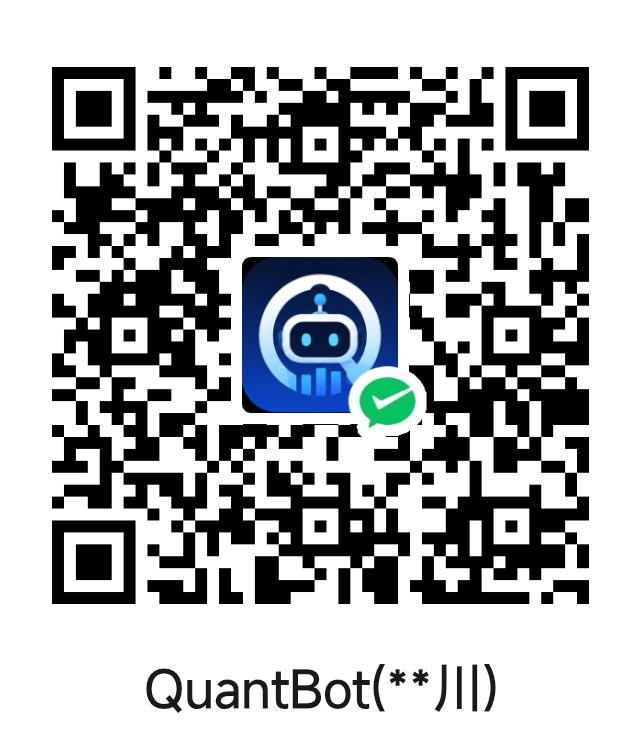 | 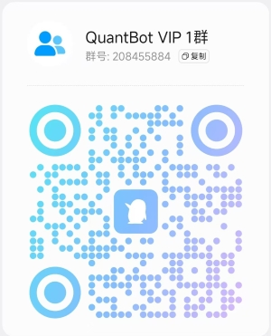 |

### 🆓 免费群

如果您不想支付费用，也可以直接加我们的免费企鹅群。用企鹅直接扫二维码入群。

<p align="center">
  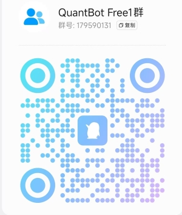
</p>

### 💼 商务洽谈

请直接扫微信二维码：

<p align="center">
  
</p>

---

## ⚠️ Disclaimer

QuantBot 仅供学习、研究和量化投资实验使用。

程序产生的信号、评分、策略、AI 分析、投资决策、回测结果，均基于历史数据与模型计算。

**不保证未来收益，也不构成任何投资建议。** 金融市场存在风险。

模拟交易结果不代表真实交易结果。使用 QMT 等接口进行实盘交易时，请充分理解相关风险，并遵守适用的法律法规、交易所及券商规定。

**请始终只使用你能够承受损失的资金进行投资。**

> 💡 程序运行过程中，需要消耗一定的 Token 成本，请根据自己的需要调整刷新频率。

---

<p align="center">
  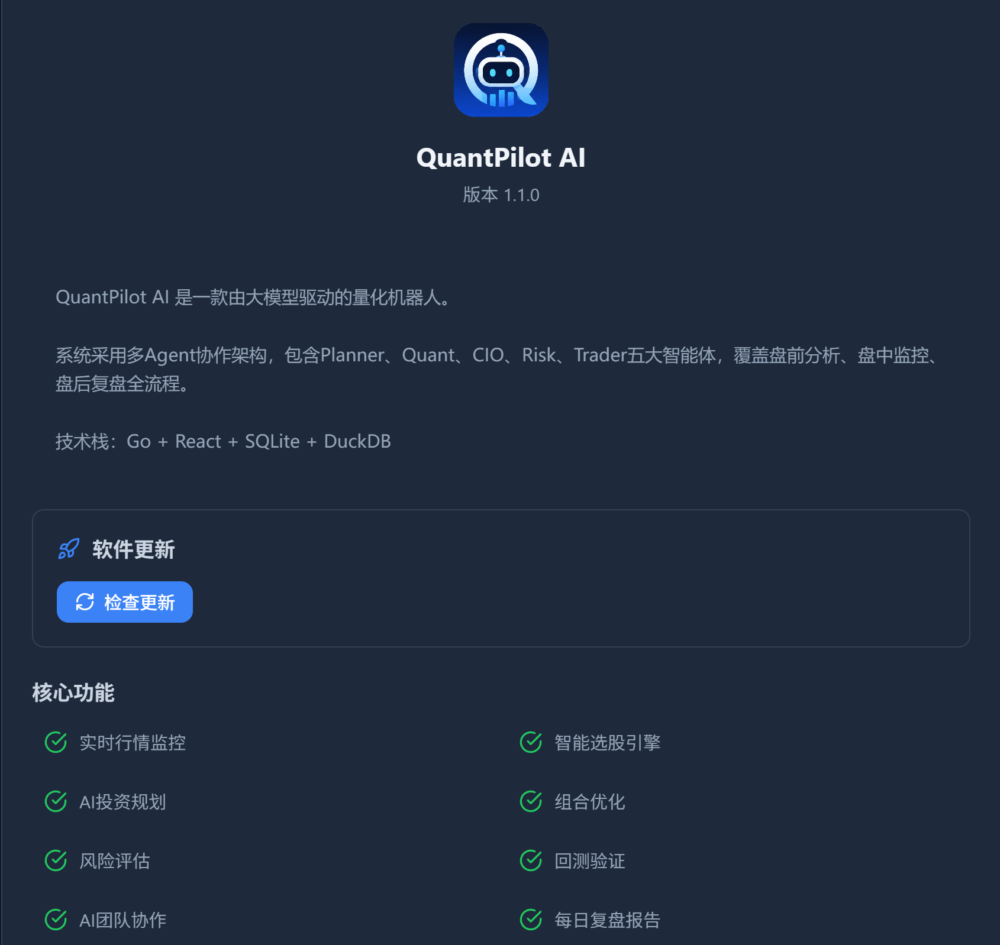
</p>

<h2 align="center">🤖 QuantBot</h2>

<p align="center">
  <b>AI × Quant × Risk × Portfolio</b><br>
  <i>让 AI 成为你的投资团队。</i>
</p>

<p align="center">
  ⭐ Star · 🍴 Fork · 🐛 Issue · ☕ Support
</p>

<p align="center">
  <b>Made with ❤️ by QuantBot Lab</b>
</p>
